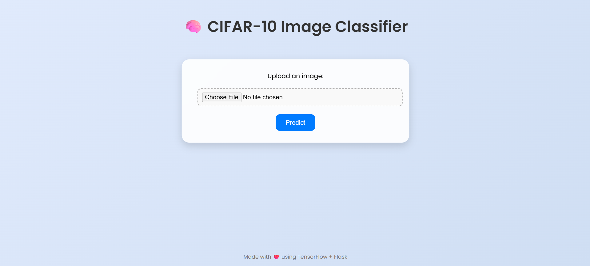
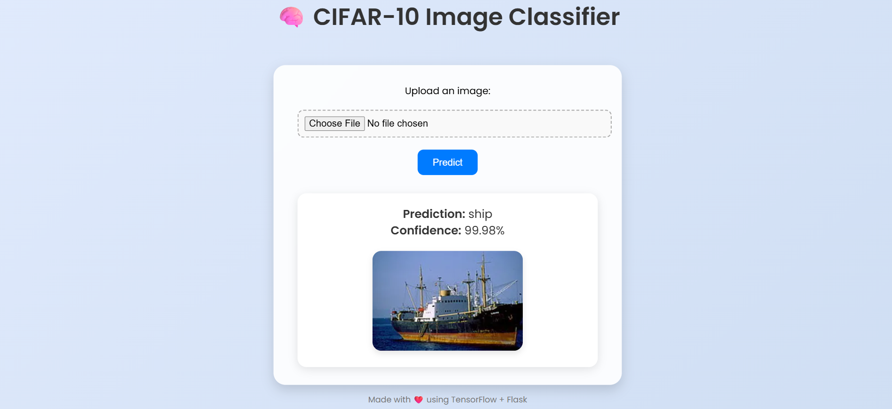

# 🧠 CIFAR-10 Image Classification using Deep Learning & Flask Web App

A complete deep learning project using TensorFlow and Keras to classify images from the CIFAR-10 dataset. Includes model training, evaluation graphs, and a beautiful Flask web interface for real-time image prediction.

---

## 📦 Dataset

- CIFAR-10: 60,000 32x32 color images in 10 classes:
  - `airplane`, `automobile`, `bird`, `cat`, `deer`, `dog`, `frog`, `horse`, `ship`, `truck`
- Automatically loaded using:
  ```python
  from tensorflow.keras.datasets import cifar10
  (x_train, y_train), (x_test, y_test) = cifar10.load_data()
  ```

---

## 🧠 Model Architecture

```python
from tensorflow.keras.models import Sequential
from tensorflow.keras.layers import Conv2D, MaxPooling2D, Flatten, Dense, Dropout

model = Sequential([
    Conv2D(32, (3,3), activation='relu', input_shape=(32,32,3)),
    Conv2D(64, (3,3), activation='relu'),
    MaxPooling2D(2,2),
    Dropout(0.25),

    Conv2D(64, (3,3), activation='relu'),
    Conv2D(128, (3,3), activation='relu'),
    MaxPooling2D(2,2),
    Dropout(0.25),

    Flatten(),
    Dense(512, activation='relu'),
    Dropout(0.5),
    Dense(10, activation='softmax')
])

model.compile(optimizer='adam', loss='sparse_categorical_crossentropy', metrics=['accuracy'])
```

---

## 🔁 Data Augmentation

```python
from tensorflow.keras.preprocessing.image import ImageDataGenerator

datagen = ImageDataGenerator(
    rotation_range=15,
    width_shift_range=0.1,
    height_shift_range=0.1,
    horizontal_flip=True
)
datagen.fit(x_train)
```

---

## 📊 Visualizations

```python
import matplotlib.pyplot as plt
import seaborn as sns
from sklearn.metrics import classification_report, confusion_matrix

# Accuracy and loss
plt.plot(history.history['accuracy'], label='Train Accuracy')
plt.plot(history.history['val_accuracy'], label='Validation Accuracy')
plt.legend()
plt.title('Accuracy')
plt.show()

plt.plot(history.history['loss'], label='Train Loss')
plt.plot(history.history['val_loss'], label='Validation Loss')
plt.legend()
plt.title('Loss')
plt.show()

# Confusion Matrix
y_pred = model.predict(x_test)
y_pred_classes = y_pred.argmax(axis=1)
cm = confusion_matrix(y_test, y_pred_classes)
sns.heatmap(cm, annot=True, fmt='d')
plt.title('Confusion Matrix')
plt.show()

# Classification Report
print(classification_report(y_test, y_pred_classes))
```

---

## 🌐 Flask Web App

### Project Structure

```
cifar10-app/
│
├── main.py               # Flask backend
├── cifar10_model.h5      # Trained model
├── templates/
│   └── index.html        # Web page
├── static/
│   ├── style.css         # Custom/Tailwind CSS
│   ├── home.png          # Screenshot of home page
│   └── predict.png       # Screenshot of prediction result
├── uploads/              # For user image uploads
├── requirements.txt
└── README.md
```

---

### Sample `main.py`

```python
from flask import Flask, render_template, request
from tensorflow.keras.models import load_model
import numpy as np
from PIL import Image
import os

app = Flask(__name__)
model = load_model('cifar10_model.h5')
classes = ['Airplane','Automobile','Bird','Cat','Deer','Dog','Frog','Horse','Ship','Truck']

def preprocess(image_path):
    img = Image.open(image_path).resize((32,32))
    return np.expand_dims(np.array(img)/255.0, axis=0)

@app.route('/', methods=['GET', 'POST'])
def index():
    prediction = None
    if request.method == 'POST':
        file = request.files['image']
        filepath = os.path.join('uploads', file.filename)
        file.save(filepath)
        image = preprocess(filepath)
        pred = model.predict(image)[0]
        prediction = dict(zip(classes, [round(p*100, 2) for p in pred]))
    return render_template('index.html', prediction=prediction)

if __name__ == '__main__':
    app.run(debug=True)
```

---

### Sample `index.html` (modern frontend)

```html
<!DOCTYPE html>
<html lang="en">
<head>
  <title>CIFAR-10 Classifier</title>
  <link href="https://cdn.jsdelivr.net/npm/tailwindcss@2.2.19/dist/tailwind.min.css" rel="stylesheet">
</head>
<body class="bg-gray-900 text-white flex items-center justify-center min-h-screen">
  <div class="text-center">
    <h1 class="text-4xl font-bold mb-4">CIFAR-10 Image Classifier</h1>
    <form action="/" method="POST" enctype="multipart/form-data" class="space-y-4">
      <input type="file" name="image" accept="image/*" class="block mx-auto text-gray-900 p-2 rounded">
      <button type="submit" class="bg-blue-600 px-6 py-2 rounded hover:bg-blue-700">Predict</button>
    </form>
    
      <h2 class="text-2xl mt-6 font-semibold">Prediction</h2>
      <ul class="mt-4">
        
          <li class="text-lg">{{ label }}: {{ prob }}%</li>
        
      </ul>
    
  </div>
</body>
</html>
```

---

## 📸 Screenshots

### 🔹 Homepage



### 🔹 Prediction Page



---

## 🚀 How to Run This Project

```bash
# Clone the repo
git clone https://github.com/yourusername/cifar10-app.git
cd cifar10-app

# Install dependencies
pip install -r requirements.txt

# Run the Flask app
python main.py
```

Then open your browser to `http://127.0.0.1:5000/`

---

## ✅ Requirements (`requirements.txt`)

```
flask
tensorflow
numpy
pillow
matplotlib
seaborn
```

---

## ⚠️ Known Limitations

- CIFAR-10 images are low-resolution (32x32), so predictions may be wrong on complex or blurry images.
- Improve by:
  - Using transfer learning (e.g., ResNet)
  - Training longer
  - Using higher-resolution datasets

---

## 📃 License

MIT License  
© 2025 [Adarsh](https://github.com/Adarsh130)
# 🧠 CIFAR-10 Image Classification using Deep Learning & Flask Web App

A complete deep learning project using TensorFlow and Keras to classify images from the CIFAR-10 dataset. Includes model training, evaluation graphs, and a beautiful Flask web interface for real-time image prediction.

---

## 📦 Dataset

- CIFAR-10: 60,000 32x32 color images in 10 classes:
  - `airplane`, `automobile`, `bird`, `cat`, `deer`, `dog`, `frog`, `horse`, `ship`, `truck`
- Automatically loaded using:
  ```python
  from tensorflow.keras.datasets import cifar10
  (x_train, y_train), (x_test, y_test) = cifar10.load_data()
  ```

---

## 🧠 Model Architecture

```python
from tensorflow.keras.models import Sequential
from tensorflow.keras.layers import Conv2D, MaxPooling2D, Flatten, Dense, Dropout

model = Sequential([
    Conv2D(32, (3,3), activation='relu', input_shape=(32,32,3)),
    Conv2D(64, (3,3), activation='relu'),
    MaxPooling2D(2,2),
    Dropout(0.25),

    Conv2D(64, (3,3), activation='relu'),
    Conv2D(128, (3,3), activation='relu'),
    MaxPooling2D(2,2),
    Dropout(0.25),

    Flatten(),
    Dense(512, activation='relu'),
    Dropout(0.5),
    Dense(10, activation='softmax')
])

model.compile(optimizer='adam', loss='sparse_categorical_crossentropy', metrics=['accuracy'])
```

---

## 🔁 Data Augmentation

```python
from tensorflow.keras.preprocessing.image import ImageDataGenerator

datagen = ImageDataGenerator(
    rotation_range=15,
    width_shift_range=0.1,
    height_shift_range=0.1,
    horizontal_flip=True
)
datagen.fit(x_train)
```

---

## 📊 Visualizations

```python
import matplotlib.pyplot as plt
import seaborn as sns
from sklearn.metrics import classification_report, confusion_matrix

# Accuracy and loss
plt.plot(history.history['accuracy'], label='Train Accuracy')
plt.plot(history.history['val_accuracy'], label='Validation Accuracy')
plt.legend()
plt.title('Accuracy')
plt.show()

plt.plot(history.history['loss'], label='Train Loss')
plt.plot(history.history['val_loss'], label='Validation Loss')
plt.legend()
plt.title('Loss')
plt.show()

# Confusion Matrix
y_pred = model.predict(x_test)
y_pred_classes = y_pred.argmax(axis=1)
cm = confusion_matrix(y_test, y_pred_classes)
sns.heatmap(cm, annot=True, fmt='d')
plt.title('Confusion Matrix')
plt.show()

# Classification Report
print(classification_report(y_test, y_pred_classes))
```

---

## 🌐 Flask Web App

### Project Structure

```
cifar10-app/
│
├── main.py               # Flask backend
├── cifar10_model.h5      # Trained model
├── templates/
│   └── index.html        # Web page
├── static/
│   ├── style.css         # Custom/Tailwind CSS
│   ├── home.png          # Screenshot of home page
│   └── predict.png       # Screenshot of prediction result
├── uploads/              # For user image uploads
├── requirements.txt
└── README.md
```

---

### Sample `main.py`

```python
from flask import Flask, render_template, request
from tensorflow.keras.models import load_model
import numpy as np
from PIL import Image
import os

app = Flask(__name__)
model = load_model('cifar10_model.h5')
classes = ['Airplane','Automobile','Bird','Cat','Deer','Dog','Frog','Horse','Ship','Truck']

def preprocess(image_path):
    img = Image.open(image_path).resize((32,32))
    return np.expand_dims(np.array(img)/255.0, axis=0)

@app.route('/', methods=['GET', 'POST'])
def index():
    prediction = None
    if request.method == 'POST':
        file = request.files['image']
        filepath = os.path.join('uploads', file.filename)
        file.save(filepath)
        image = preprocess(filepath)
        pred = model.predict(image)[0]
        prediction = dict(zip(classes, [round(p*100, 2) for p in pred]))
    return render_template('index.html', prediction=prediction)

if __name__ == '__main__':
    app.run(debug=True)
```

---

### Sample `index.html` (modern frontend)

```html
<!DOCTYPE html>
<html lang="en">
<head>
  <title>CIFAR-10 Classifier</title>
  <link href="https://cdn.jsdelivr.net/npm/tailwindcss@2.2.19/dist/tailwind.min.css" rel="stylesheet">
</head>
<body class="bg-gray-900 text-white flex items-center justify-center min-h-screen">
  <div class="text-center">
    <h1 class="text-4xl font-bold mb-4">CIFAR-10 Image Classifier</h1>
    <form action="/" method="POST" enctype="multipart/form-data" class="space-y-4">
      <input type="file" name="image" accept="image/*" class="block mx-auto text-gray-900 p-2 rounded">
      <button type="submit" class="bg-blue-600 px-6 py-2 rounded hover:bg-blue-700">Predict</button>
    </form>
    
      <h2 class="text-2xl mt-6 font-semibold">Prediction</h2>
      <ul class="mt-4">
        
          <li class="text-lg">{{ label }}: {{ prob }}%</li>
        
      </ul>
    
  </div>
</body>
</html>
```

---

## 📸 Screenshots

### 🔹 Homepage


### 🔹 Prediction Page


---

## 🚀 How to Run This Project

```bash
# Clone the repo
git clone https://github.com/yourusername/cifar10-app.git
cd cifar10-app

# Install dependencies
pip install -r requirements.txt

# Run the Flask app
python main.py
```

Then open your browser to `http://127.0.0.1:5000/`

---

## ✅ Requirements (`requirements.txt`)

```
flask
tensorflow
numpy
pillow
matplotlib
seaborn
```

---

## ⚠️ Known Limitations

- CIFAR-10 images are low-resolution (32x32), so predictions may be wrong on complex or blurry images.
- Improve by:
  - Using transfer learning (e.g., ResNet)
  - Training longer
  - Using higher-resolution datasets

---

## 📃 License

MIT License  
© 2025 
